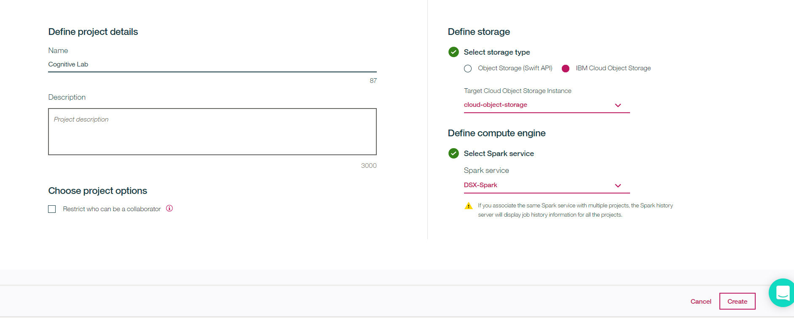
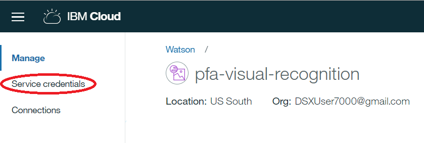

# Uncover insights from Facebook with PixieDust and a cognitive Jupyter notebook

In this Code Pattern, we will use a Jupyter notebook to glean insights from a vast body of unstructured data. Credit goes to [Anna Quincy](https://www.linkedin.com/in/anna-quincy-25042957) and [Tyler Andersen](https://www.linkedin.com/in/tyler-andersen-2bb82336) for providing the initial notebook design.

We'll start with data exported from Facebook Analytics. We'll enrich the data with Watson’s Natural Language Understanding (NLU), Tone Analyzer and Visual Recognition.

The standard Facebook Analytics export features text from posts, articles, and thumbnails, along with standard Facebook performance metrics such as likes, shares, and impressions. For this exercise, we have enriched the posts content with Watson APIs to extract keywords, entities, sentiment, and tone. Similar processing could be done for the articles and thumbnail text as well. 

After data is enriched with Watson APIs, there are several different types of ways to analyze it. The Data Science Experience (DSX) provides a robust, yet flexible method of exploring the unstructured, enriched Facebook content.

This Code Pattern provides mock Facebook data, a notebook, and comes with several pre-built visualizations to jump start you with uncovering hidden insights.

When the reader has completed this Code Pattern, they will understand how to:

 * Read external data in to a DSX Jupyter notebook via DSX Object Storage and pandas DataFrames.
 * Use a Jupyter notebook and Watson APIs to enrich data unstructured data using:
     * [Natural Language Understanding](https://www.ibm.com/watson/developercloud/natural-language-understanding.html)
     * [Tone Analyzer](https://www.ibm.com/watson/developercloud/tone-analyzer.html)
     * [Visual Recognition](https://www.ibm.com/watson/developercloud/visual-recognition.html)
 * Write data from a pandas DataFrame in a DSX Jupyter notebook out to a file in DSX Object Storage.
 * Visualize and explore the enriched data with [PixieDust](https://github.com/ibm-cds-labs/pixiedust).


## Flow
1. A CSV file exported from Facebook Analytics is added to DSX Object Storage.
2. Generated code makes the file accessible as a pandas DataFrame.
3. The data is enriched with Natural Language Understanding.
4. The data is enriched with Tone Analyzer.
5. The data is enriched with Visual Recognition.
6. The enriched data can be explored with PixieDust to uncover hidden insights and create graphics to highlight them.

# Included components

* [IBM Data Science Experience](https://www.ibm.com/bs-en/marketplace/data-science-experience): Analyze data using RStudio, Jupyter, and Python in a configured, collaborative environment that includes IBM value-adds, such as managed Spark.
* [IBM Object Storage](https://console.ng.bluemix.net/catalog/services/object-storage/?cm_sp=dw-bluemix-_-code-_-devcenter): An IBM Cloud service that provides an unstructured cloud data store to build and deliver cost effective apps and services with high reliability and fast speed to market.
* [Watson Natural Language Understanding](https://www.ibm.com/watson/developercloud/natural-language-understanding.html): Natural language processing for advanced text analysis.
* [Watson Tone Analyzer](https://www.ibm.com/watson/developercloud/tone-analyzer.html): Uses linguistic analysis to detect communication tones in written text.
* [Visual Recognition](https://www.ibm.com/watson/developercloud/visual-recognition.html): Understand image content.

# Featured technologies

* [Jupyter Notebooks](http://jupyter.org/): An open-source web application that allows you to create and share documents that contain live code, equations, visualizations and explanatory text.
* [PixieDust](https://github.com/ibm-cds-labs/pixiedust): PixieDust is an open source helper library that works as an add-on to Jupyter notebooks to improve the user experience of working with data.
* [pandas](http://pandas.pydata.org/): A Python library providing high-performance, easy-to-use data structures.
* [Beautiful Soup](https://www.crummy.com/software/BeautifulSoup/bs4/doc/): Beautiful Soup is a Python library for pulling data out of HTML and XML files.
* [Data Science](https://developer.ibm.com/code/technologies/data-science/): Systems and scientific methods to analyze structured and unstructured data in order to extract knowledge and insights.
* [Cognitive](https://developer.ibm.com/watson/): Watson is a cognitive technology that can think like a human.
* [Analytics](https://developer.ibm.com/code/technologies/analytics/): Analytics delivers the value of data for the enterprise.
* [Python](https://www.python.org/): Python is a programming language that lets you work more quickly and integrate your systems more effectively.

# Steps

Follow these steps to setup and run this Code Pattern. The steps are
described in detail below.

1. [Sign up for the Data Science Experience](#1-sign-up-for-the-Data-Science-Experience)
1. [Create a project](#2-create-a-project)
1. [Create the notebook](#3-create-the-notebook)
1. [Create IBM Cloud services](#4-create-ibm-cloud-services)
1. [Add credentials](#5-add-credentials)
1. [Add the CSV file](#6-add-the-csv-file)
1. [Run the notebook](#7-run-the-notebook)
1. [Analyze the results](#8-analyze-the-results)
1. [Save your work](#9-save-your-work)


## 1. Sign up for the Data Science Experience

We recommend using the Firefox browser.

__NOTE__: If you already have a DSX account, please skip to __Step 2__.

#### Create an account.

1.  Go to [http://datascience.ibm.com/](http://datascience.ibm.com/)

2.  Click the Sign Up button on the top right

> 


3. Enter your email, click to accept the terms, and click Next. Note: If you already have an IBM id you can click Sign in with your IBM id -- if you don't have a DSX account one will be created for you.

> 

4. On the next page, fill in the corresponding fields and click Create Account

 >  

5. You will see the following screen. You need to go to your e-mail account to complete the sign up process. 

 > 

6. In your e-mail inbox, there should be a message from The Bluemix Team. 

 >  

7. Open the e-mail and click on Confirm Account. 

 >  

8. Go back to the DSX session, and enter your DSX user id (e-mail account) and click Continue. 
 >  

9. Enter your password and click Sign in. 
 >  
 
10. Select the IBM Cloud Account (IBM), select the organization (your e-mail), and then select the space (dev) and click Continue.
 >  

 
11. It will take several minutes to set up the account. You will see several screens pop-up (e.g. Preparing Object-Storage, Initializing Environment). Wait until you see the following screen and then click on Get Started.

>  


 > You are now in the Data Science Experience landing page. Your environment is automatically set up with one Apache Spark instance and 5 GB of object storage. From here you can explore any of the tutorials, videos, sample notebooks, tutorials or articles in the community.

>  

## 2. Create a project

1. Click on Projects > View All Projects to see a list of your projects. You should only see a default project.

 >  

2. Click on the New project icon on the top right of the project list.

 >  

3. Type a name for your project. For instance, "Cognitive Lab". A Spark service and an object storage service will be automatically selected. Click on Create.

 

 > You are now in your new project where you can create notebooks and data assets as well as add collaborators.
 
 

## 3. Create the notebook

You can create the notebook in DSX using the URL of the notebook that is in this git repo (or similarly from a local file if you cloned the repo).

1. Use the menu on the left to select `My Projects` and then `Cognitive Lab`.
1. Click on `Add notebooks` (upper right) to create a notebook.
1. Select the `From URL` tab.
1. Enter a name for the notebook such as Facebook Analysis.
1. Optionally, enter a description for the notebook.
1. Enter this Notebook URL:
   
   https://github.com/bleonardb3/pixiedust-facebook-analysis/blob/master/notebooks/Facebook%20Analysis.ipynb
   
1. Click the `Create Notebook` button.


## 4. Create IBM Cloud services

Create the following IBM Cloud services by clicking the `Deploy to IBM Cloud` button below, or use these links to create the services in the IBM Cloud UI.

  * [**Visual Recognition**](https://console.ng.bluemix.net/catalog/services/visual-recognition)
  * [**Natural Language Understanding**](https://console.ng.bluemix.net/catalog/services/natural-language-understanding)
  * [**Tone Analyzer**](https://console.ng.bluemix.net/catalog/services/tone-analyzer)
  
### 4.1 [](https://bluemix.net/deploy?repository=https://github.com/ibm/pixiedust-facebook-analysis)

### 4.2 Click on the Deploy button


### 4.3 Click on the Delivery Pipeline


### 4.4 Wait until the Deploy passed message is displayed. 


### 4.4 Click on the "Hamburger" icon at the top left  and then click on Dashboard


### 4.5 You should see 3 new services deployed as below. 


## 5. Add service credentials

### 5.1 Click on the Visual Recognition Service


### 5.2 Click on Service Credentials


### 5.3 Click on New Credentials


### 5.4 Click on Add 


### 5.5 Click on View Credentials and then copy the api key. 


### 5.6 Find the notebook cell after `1.5. Add Service Credentials From IBM Cloud for Watson Services`. Replace the <add_vr_api_key> with the copied key. 


### 5.7 Follow the same procedure to get the username and password credentials for the Natural Language Understanding service and the Tone Analyzer service.  


> Note: This cell is marked as a `hidden_cell` because it will contain sensitive credentials.

## 6. Add the CSV file

### 6.1 Download the csv file from here:
https://github.com/bleonardb3/pixiedust-facebook-analysis/blob/master/data/example_facebook_data.csv

### 6.2 Right click on Raw then click on Save link as .... to save the file to the computer. 


### 6.3 Add the CSV file to the notebook
Use `Find and Add Data` 
and its `Files` tab. From there you can click
`browse` and add a .csv file from your computer.


### 6.4 Insert to code
Find the notebook cell after `2.1 Load data from Object Storage`. Place your cursor after `# Insert pandas DataFrame`. Make sure this cell is selected before inserting code.

Using the file that you added above (under the  tab),
use the `Insert to code` drop-down menu.
Select `Insert Pandas DataFrame` from the drop-down menu.


> Note: This cell is marked as a hidden_cell because it contains
sensitive credentials.


### 6.5  Fix-up variable names
The inserted code includes a generated method with credentials and then calls
the generated method to set a variable with a name like `df_data_1`. If you do
additional inserts, the method can be re-used and the variable will change
(e.g. `df_data_2`).

Later in the notebook, we set `df = df_data_1`. So you might need to
fix the variable name `df_data_1` to match your inserted code or vice versa.

### 6.6 Add file credentials

We want to write the enriched file to the same container that we used above. So now we'll use the same file drop-down to insert credentials. We'll use them later when we write out the enriched CSV file.

After the `df` setup, there is a cell to enter the file credentials.
Place your cursor after the `#insert credentials for file - Change to credentials_1` line. Make sure this cell is selected before inserting credentials.

Use the CSV file's drop-down menu again. This time select `Insert Credentials`.


Note: This cell is marked as a `hidden_cell` because it contains sensitive credentials.

### 6.7 Fix-up variable names
The inserted code includes a dictionary with credentials assigned to a variable
with a name like `credentials_1`. It may have a different name (e.g. `credentials_2`).
Rename it or reassign it if needed. The notebook code assumes it will be `credentials_1`.

## 7. Run the notebook

When a notebook is executed, what is actually happening is that each code cell in
the notebook is executed, in order, from top to bottom.

Each code cell is selectable and is preceded by a tag in the left margin. The tag
format is `In [x]:`. Depending on the state of the notebook, the `x` can be:

* A blank, this indicates that the cell has never been executed.
* A number, this number represents the relative order this code step was executed.
* A `*`, this indicates that the cell is currently executing.

There are several ways to execute the code cells in your notebook:

* One cell at a time.
  * Select the cell, and then press the `Play` button in the toolbar, or select the cell, and then press Shift + Enter keys
* Batch mode, in sequential order.
  * From the `Cell` menu bar, there are several options available. For example, you
    can `Run All` cells in your notebook, or you can `Run All Below`, that will
    start executing from the first cell under the currently selected cell, and then
    continue executing all cells that follow.
* At a scheduled time.
  * Press the `Schedule` button located in the top right section of your notebook
    panel. Here you can schedule your notebook to be executed once at some future
    time, or repeatedly at your specified interval.

## 8. Analyze the results

### Part I - Enrich

If you walk through the cells, you will see that we demonstrated how to do the following in Part I:

* Install external libraries from PyPI
* Create clients to connect to Watson cognitive services
* Load data from a local CSV file to a pandas DataFrame (via Object Storage)
* Do some data manipulation with pandas
* Use BeautifulSoup
* Use Natural Language Understanding
* Use Tone Analyzer
* Use Visual Recognition
* Save the enriched data in a CSV file in Object Storage

### Part II - Data Preparation

In Part II, we used pandas to create multiple DataFrames from our main enriched DataFrame. After slicing and dicing and cleaning, these new DataFrames are ready for PixieDust to use.

### Part III - Analyze

In Part III, we analyze the results by exploring and visualizing the metrics with PixieDust.

After all the prep work done earlier, you'll see that there is almost no code
needed here (thanks to PixieDust). We just use one-liners like this:
```python
display(<data-frame>)
```

You should also notice that we used ```display(tones)``` in two different
cells, but the result was two different charts. How can that happen?
Well, we used cell metadata to tell PixieDust how to display the data.
Notice the `Edit Metadata` button on each cell. If you don't see it, use the menu
`View > Cell Toolbar > Edit Metadata` to make it visible. If you look at
the metadata for the first two charts, you'll see how we got a bar chart and a pie chart.

**PixieDust is interactive!** This is where we explore to find out what
the enriched data will tell us.

Use the `Options` button to change the chart settings. The first chart shows
post consumption by the detected emotion in the article. Notice how changing
the aggregation type from SUM to AVG gives you a very different conclusion.
You can also change it to COUNT to see the frequency of each emotion, but when you do that the metric no longer matters.

Explore by trying the following:
* Use social tone as the key instead of emotion tone (or both).
* Try other metrics such as lifetime negative feedback from users. 
* Try the different renderers.
* Try different chart types (and a grid).

The right combination will give you insights into the impact of
your facebook posts. Once you uncover the insights, find the best
presentation to convince others.

## 9. Save your work

### How to save your work:

Under the `File` menu, there are several ways to save your notebook:

* `Save` will simply save the current state of your notebook, without any version
  information.
* `Save Version` will save your current state of your notebook with a version tag
  that contains a date and time stamp. Up to 10 versions of your notebook can be
  saved, each one retrievable by selecting the `Revert To Version` menu item.

# Sample output

The example output in data/examples has embedded JavaScript for
PixieDust charts. View it via github pages: [here](https://ibm.github.io/pixiedust-facebook-analysis/data/examples/pixiedust_facebook_analysis.html)

> Note: Some interactive functionality does not work in the HTML sample. Run the notebook for full functionality. To see the code and markdown cells without output, you can view [notebooks/pixiedust_facebook_analysis.ipynb](notebooks/pixiedust_facebook_analysis.ipynb) with the github viewer.

# Links

* [Demo on Youtube](https://www.youtube.com/watch?v=UIkjFo9o3vI)
* [PixieDust Documentation](https://ibm-cds-labs.github.io/pixiedust/index.html)
* [PixieDust GitHub Repo](https://github.com/ibm-cds-labs/pixiedust)
* [Watson Accelerators](http://www.watsonaccelerators.com)
* [Cognitive discovery architecture](https://www.ibm.com/devops/method/content/architecture/cognitiveDiscoveryDomain2)
* [Facebook Analytics Developer Docs](https://developers.facebook.com/docs/analytics)
* [A Robot Befriends Classic Monsters Using Watson APIs](https://medium.com/ibm-developer-advocacy/a-robot-befriends-classic-monsters-using-watson-apis-part-1-76b1cc64957e)

# Learn more

* **Artificial Intelligence Code Patterns**: Enjoyed this Code Pattern? Check out our other [AI Code Patterns](https://developer.ibm.com/code/technologies/artificial-intelligence/).
* **Data Analytics Code Patterns**: Enjoyed this Code Pattern? Check out our other [Data Analytics Code Patterns](https://developer.ibm.com/code/technologies/data-science/)
* **AI and Data Code Pattern Playlist**: Bookmark our [playlist](https://www.youtube.com/playlist?list=PLzUbsvIyrNfknNewObx5N7uGZ5FKH0Fde) with all of our Code Pattern videos
* **With Watson**: Want to take your Watson app to the next level? Looking to utilize Watson Brand assets? [Join the With Watson program](https://www.ibm.com/watson/with-watson/) to leverage exclusive brand, marketing, and tech resources to amplify and accelerate your Watson embedded commercial solution.
* **Data Science Experience**: Master the art of data science with IBM's [Data Science Experience](https://datascience.ibm.com/)

# License

[Apache 2.0](LICENSE)
